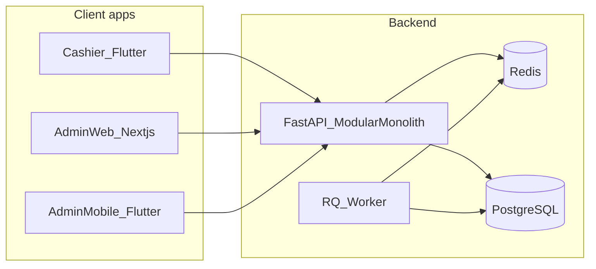

# Architecture Overview

This is the high-level architecture snapshot for the current implementation.

## Scope

- Offline-first inventory and POS platform
- Multi-tenant, multi-shop backend
- Cashier-first transactional flows
- Operational admin surfaces (web + mobile baseline)

## System components

- `apps/cashier`: Flutter cashier app (primary write client)
- `apps/admin-web`: Next.js admin dashboard
- `apps/admin_mobile`: Flutter admin companion app
- `services/api`: FastAPI modular monolith
- `packages/sync-protocol`: OpenAPI sync and domain contract
- `docker-compose.yml`: local/on-prem runtime topology

## Runtime topology

## Backend module map

Implemented capability routers:

- `health`
- `devices`
- `sync`
- `transactions`
- `admin`
- `tenants`
- `shops`
- `inventory`
- `reporting`
- `audit`
- `notifications`

Registered in: `services/api/app/main.py`.

## Data model principles

- Stock is tracked through immutable `stock_movements`.
- Commercial ledger uses `transactions`, `transaction_lines`, and `payment_allocations`.
- Tenant isolation is enforced with row-level security plus request-scoped DB context.

## Money model

- Stored amounts remain integer minor units (`*_cents` naming retained).
- Tenant-level currency metadata:
  - `default_currency_code`
  - `currency_exponent`
  - `currency_symbol_override`
- Cashier receives currency metadata through sync pull and formats values client-side.

## Maturity snapshot

- Backend sync + ledger core: implemented
- Offline cashier queue + sync status UX: implemented
- Admin web/mobile operational baseline: implemented
- Returns depth, advanced RBAC, and complete Stitch visual parity: pending iteration

