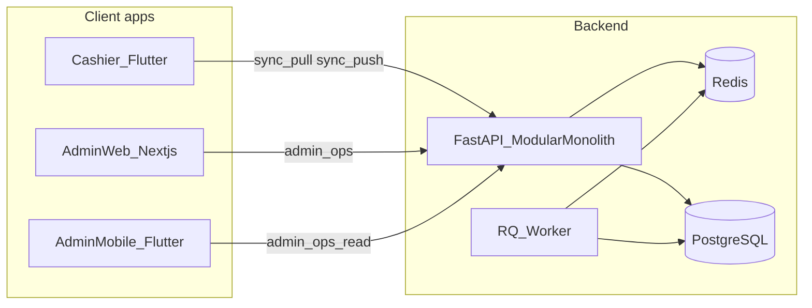

# Inventory Platform Architecture

This document summarizes the current, implemented high-level architecture for the inventory platform across backend, cashier, admin web, and admin mobile.

## Related architecture docs

- Overview: `docs/architecture-overview.md`
- Sync model and conflict handling: `docs/sync-architecture.md`
- Client apps architecture (cashier/admin web/admin mobile): `docs/client-architecture.md`
- ADR index and status: `docs/adr-index.md`

## 1) System overview

The platform is an offline-first, multi-tenant inventory and transaction system:

- **Cashier app** (`apps/cashier`) is the primary write client.
- **Admin web** (`apps/admin-web`) is the primary operational dashboard.
- **Admin mobile** (`apps/admin_mobile`) is a lightweight operational companion.
- **Backend API** (`services/api`) is a modular FastAPI monolith over PostgreSQL.
- **Redis + RQ worker** supports async/background tasks.
- **Sync contract** lives in `packages/sync-protocol/openapi.yaml`.

## 2) Topology

## 3) Backend architecture

### 3.1 Composition

The API is assembled in `services/api/app/main.py` and exposes routers by bounded capability:

- `health` (`/health`)
- `devices` (`/v1/devices/*`) onboarding + refresh
- `sync` (`/v1/sync/*`) pull/push event reconciliation
- `transactions` (`/v1/transactions`) device history view
- `admin` (`/v1/admin/*`) operator and operational controls
- `tenants`, `shops`, `inventory`, `reporting`, `audit`, `notifications`

### 3.2 Domain model

Core tables are defined in `services/api/app/models/tables.py`:

- Identity/tenancy: `tenants`, `shops`, `devices`, `admin_users`, `enrollment_tokens`
- Catalog: `products`
- Commercial ledger: `transactions`, `transaction_lines`, `payment_allocations`
- Inventory ledger: `stock_movements` (immutable deltas)

Design principle:

- **Stock is derived from immutable movements**, not overwritten as mutable state.

### 3.3 Sync and conflict model

Push processing (`services/api/app/services/sync_push.py`) validates and applies:

- `sale_completed` events
- `ledger_adjustment` events

Returns structured per-event results:

- `accepted`, `duplicate`, `rejected`
- machine-readable `conflict` payload for rejected items

### 3.4 Auth and security

- Device auth via JWT (`typ=device`) for sync/transaction flows.
- Admin access supports:
  - Legacy `X-Admin-Token`
  - Operator JWT (`typ=operator`) from `/v1/admin/auth/login`

### 3.5 Tenant isolation (RLS)

RLS is enabled for tenant-scoped tables. Request/session context sets:

- `ims.tenant_id`
- `ims.is_admin`

This is applied in DB dependency flows so read/write paths are tenant-safe by default.

## 4) Money and currency model

Amounts are stored as integer minor units (`*_cents` field names retained for compatibility).

Tenant-level display/semantic currency settings:

- `default_currency_code` (ISO-4217)
- `currency_exponent` (minor unit exponent)
- `currency_symbol_override` (optional)

Currency metadata is delivered to cashier via `/v1/sync/pull` and used for UI formatting.

Out of scope in current architecture:

- multi-currency transactions
- FX conversion
- per-shop/per-product currency overrides

## 5) Cashier app architecture

### 5.1 App structure

Key screens:

- `onboarding_screen.dart`
- `cashier_home_screen.dart`
- `cart_screen.dart`
- `history_screen.dart`
- `sync_status_screen.dart`

Shell navigation is handled by `cashier_shell.dart`.

### 5.2 Offline-first strategy

- Local session + local outbox persisted on device.
- Outbox events are encrypted at rest before DB write.
- Sync flush occurs on connectivity changes and manual sync.
- Card tender is blocked without connectivity; cash can queue offline by policy.

### 5.3 UX and theming

- Theme tokens are centralized in `apps/cashier/lib/theme.dart`.
- Current UI uses Material components with product-specific offline/sync banners and error handling.
- Stitch parity is partial (tokens + core flow), with further visual refinement still possible.

## 6) Admin surfaces

### 6.1 Admin web (`apps/admin-web`)

Current dashboard is a server-rendered operations view that reads API endpoints for:

- tenant overview
- shops
- sales summary
- stock alerts
- audit events

### 6.2 Admin mobile (`apps/admin_mobile`)

Current app is a lightweight multi-tab operational shell for:

- tenant summary
- shops
- sales snapshot
- stock alerts
- device/audit status
- approvals placeholder

## 7) Worker and async

Worker entrypoint (`services/api/app/worker/__main__.py`) runs an RQ worker on the configured queue.

Current pattern:

- API enqueues tasks (e.g., admin-triggered aggregate/report placeholders).
- Worker processes tasks via Redis queue backend.

## 8) Deployment model

`docker-compose.yml` includes:

- `postgres`
- `redis`
- `api`
- `worker`

API is published on configurable host port (default `8001`) and runs migrations on start.

## 9) Testing and quality gates

Implemented checks currently include:

- Python tests in `services/api/tests` (contract + optional integration smoke)
- Flutter analyze/test for cashier and admin mobile
- Next.js lint for admin web

## 10) Current maturity snapshot

- **Backend core sync + ledger:** implemented
- **Tenancy + RLS baseline:** implemented
- **Currency metadata at tenant level:** implemented
- **Cashier offline queue + sync UX:** implemented
- **Admin web/mobile operational views:** implemented as baseline
- **Advanced RBAC, returns workflow depth, full Stitch visual parity:** pending/iterative

