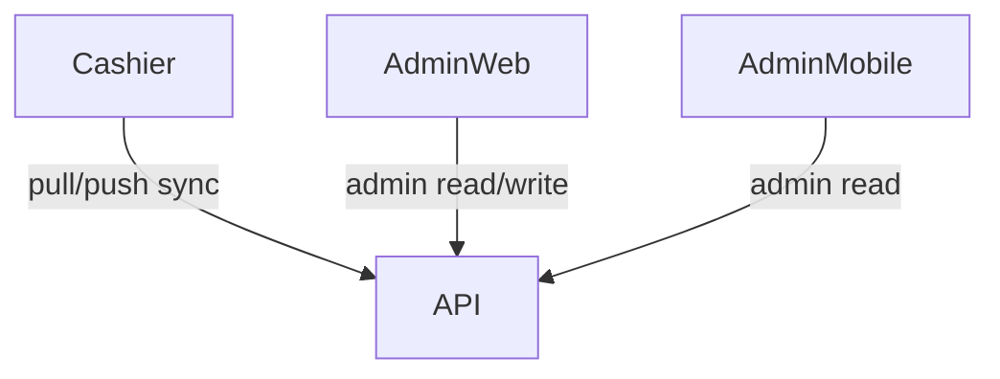

# Client Architecture

This document summarizes current client app architecture across cashier, admin web, and admin mobile.

## Cashier app (`apps/cashier`)

### Responsibilities

- Device onboarding and token refresh
- Inventory lookup and cart checkout
- Transaction history
- Offline event queue and sync status UX

### Key screens

- `onboarding_screen.dart`
- `cashier_shell.dart` (bottom navigation)
- `dashboard_screen.dart`
- `inventory_lookup_screen.dart`
- `cart_screen.dart`
- `history_screen.dart`
- `sync_status_screen.dart`

### State and storage

- Session and lightweight metadata in shared preferences
- Local outbox DB for pending events
- Outbox payload encryption at rest
- Sync state model for pending count, last sync, and outbox failures

### UI status — Stitch (Tactile Archive) parity

- **Tokens**: Colors, spacing scale, hero gradient, and radii follow Stitch project `2327673696871788694` via `cashier_tokens.dart`.
- **Polish pass**: Shared radii (`CashierRadius`), navigation bar elevation, card/tile/metric treatments, `SliverAppBar.medium` on the dashboard, and typography (`theme.dart`) are aligned to the Stitch “tactile archive” direction.
- **Reference assets**: Screen IDs and download workflow live in [`docs/design/stitch-cashier/README.md`](design/stitch-cashier/README.md).

**Definition of done (sign-off)**

1. On a primary phone viewport, compare **Dashboard, Lookup, Cart, History** to the Stitch references (same project): layout hierarchy, spacing rhythm, section headers, primary CTA prominence, empty states, list density, and bottom navigation.
2. No unexplained drift from `CashierColors` / `CashierSpacing` / `CashierRadius` on those flows.
3. Intentional platform-only differences (e.g. OS status bar) are noted in a PR or here under *Scoped exceptions*.

**Scoped exceptions**

- None recorded.

### Catalog / variants (cashier)

- Sync pull includes optional `product_group_id`, `group_title`, and `variant_label` per product.
- Lookup groups rows under `group_title` and shows `variant_label` on product cards; cart lines can show the same subtitle when present.

## Admin web (`apps/admin-web`)

### Responsibilities

- Operational visibility into tenants, shops, sales, alerts, and audit stream
- Works against backend admin endpoints

### Current implementation

- Server-rendered dashboard page with API-backed sections
- Uses configured API URL and admin token for secure calls

## Admin mobile (`apps/admin_mobile`)

### Responsibilities

- Lightweight operational companion for on-the-go checks
- Tabs for tenant summary, shops, sales, alerts, device/audit status, approvals placeholder

### Current implementation

- Flutter shell with manual API base/token entry
- Read-oriented operational lists

## Client/backend interaction model

