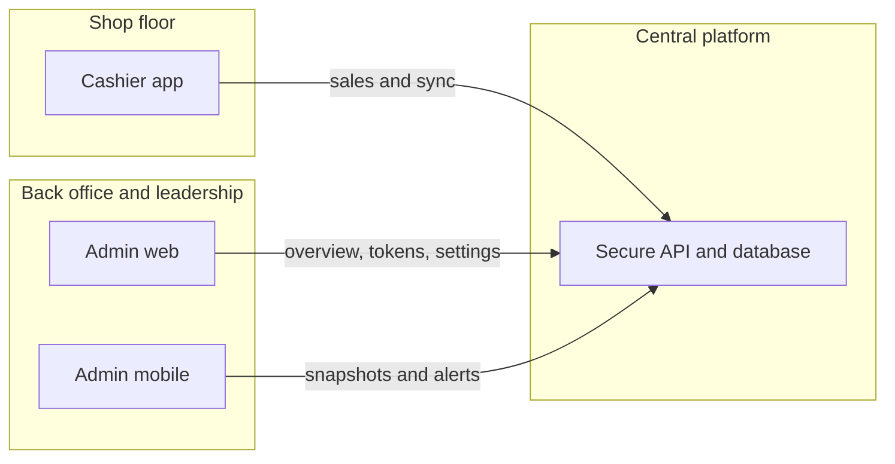
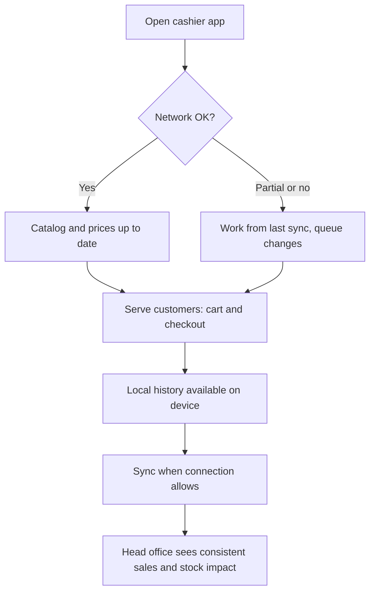
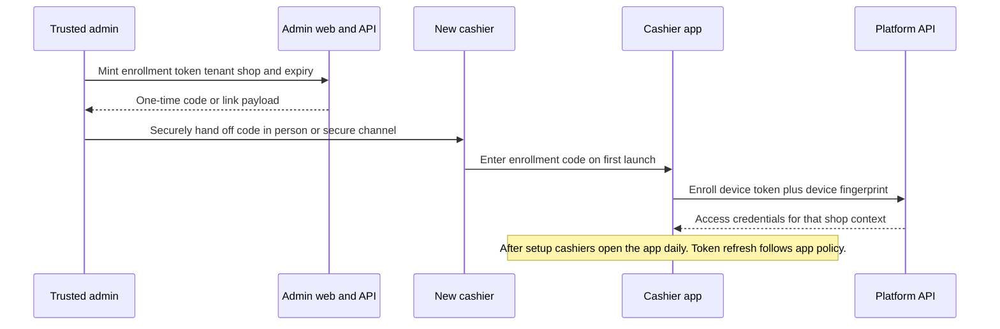
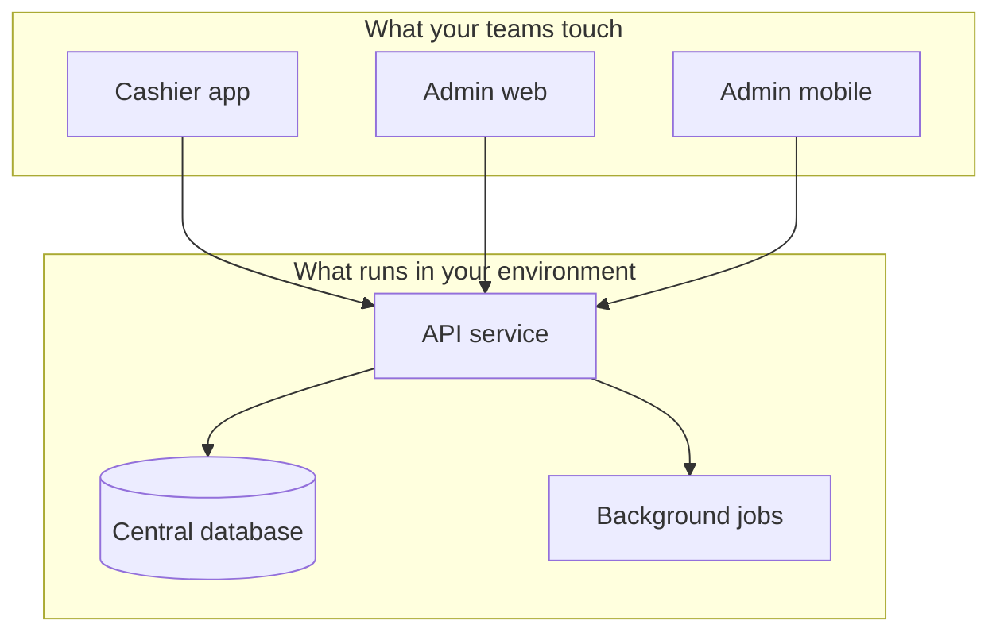

# Executive note: inventory & sales platform

**Audience:** business owners and operators  
**Purpose:** what this system does for you, how teams use it every day, and how new people get on board.

---

## Executive summary

This platform ties together **selling at the register**, **stock movements**, and **management visibility** in one system. It is built so shops can keep working when the network is unreliable: sales and updates can be held on the device and reconciled when connectivity returns, with clear rules for how different payment types behave.

Inventory is driven by an **immutable movement history**—every change is recorded—so stock figures and investigations are easier to trust than when counts live only in spreadsheets or informal adjustments.

You get **multi-tenant separation** (each organization’s data stays isolated), **cashier tooling** for the shop floor, **admin web** for deeper operational work, and **admin mobile** as a lightweight companion for checks on the go.

**In one line:** you move from fragmented manual processes to **connected shops, explainable stock, and leadership dashboards**—with a path to scale more locations without re-inventing the process each time.

---

## Who does what (at a glance)

- **Cashiers** use the cashier app to sell, view recent activity, and sync with the center when online.
- **Managers and owners** use admin web for the full operational picture (shops, sales summary, stock signals, audit-oriented views, minting device enrollment codes).
- **Managers on the move** use admin mobile for a quick read on sales, stock alerts, shops, and device status.

---

## Day-to-day operations

### Typical day on the shop floor

**What this means in practice**

| Time | What happens |
|------|----------------|
| **Store open** | Cashiers sign into the cashier app on their device (already enrolled—see onboarding below). They add items, take payment per your policies, and complete sales. |
| **Busy periods** | The app is designed for **offline-first** use: if Wi‑Fi or mobile data dips, queued work can flush when the connection is back. Card tender follows your configured rules (cash may queue offline where allowed). |
| **During the day** | Staff can check **on-device history** for recent transactions so disputes or questions are handled at the counter without waiting for a report. |
| **Back office** | On admin web (or admin mobile for a quick look), leaders see **tenant and shop overview**, **sales summaries**, **stock alerts**, and **audit-related signals** so issues surface before month-end. |
| **Adjustments** | Stock and ledger adjustments flow through the same controlled sync model, keeping the **movement trail** consistent rather than silently overwriting numbers. |

### Operationally, you should expect

1. **Fewer “mystery” stock discrepancies** because changes are recorded as movements, not only as a final count field.  
2. **Less revenue leakage from downtime** because the shop can keep recording sales when the network is unstable (within payment-type rules).  
3. **Faster managerial response** because dashboards and alerts summarize what is happening across shops without manual consolidation.

---

## New employee onboarding

Two parallel tracks matter: **people who run the business on admin tools** versus **people who sell on a cashier device**.

### 1) Back-office / manager users (admin web and admin mobile)

These users sign in with **email and password** issued by your organization (accounts are created in your admin user setup—typically by IT or a super-user process you define). After login they receive a session token that gates access to admin APIs.

**Suggested first-day checklist for a new manager**

1. Receive **corporate email** and **temporary password** (or SSO path, if you add it later).  
2. Log in to **admin web**; confirm they see only **their tenant’s** shops and data.  
3. Walk through: **overview**, **shops**, **sales summary**, **stock alerts**, and where **enrollment tokens** are created for new devices.  
4. Optional: install **admin mobile** for field checks; log in with the same credentials where supported.

### 2) Cashiers and new register devices (enrollment token flow)

Cashier devices do **not** use the same login as admin users. Each device is **bound to your tenant and a specific shop** using a **short-lived enrollment token** that a trusted admin generates.

**Suggested first-day checklist for a new cashier**

1. **Hardware:** tablet or phone with the cashier app installed (per your rollout).  
2. **Enrollment:** a supervisor provides the **enrollment token** for the correct **shop** (tokens can expire; mint a new one if needed).  
3. **Training (15–30 minutes):** cart flow, payment rules (cash vs card connectivity), **manual sync** if you ask them to use it, and **where to send the customer** if the app shows an error.  
4. **Escalation:** who to call if enrollment fails (wrong shop, expired token, or device swap).

**Security habits for owners**

- Treat enrollment tokens like **temporary front-door keys**: issue for **one shop**, **short TTL**, and **never** post them in group chat or email broadly.  
- When a device is lost or a cashier leaves, **revoke or rotate** access per your operational playbook (device table / future device revoke flows as you mature the product).

---

## How the pieces fit together (reference)

---

## Closing

This tool is meant to make **daily selling smooth**, **stock and money trails defensible**, and **leadership visibility routine**—not something you rebuild in spreadsheets every week. New hires fit a simple pattern: **admin staff** get identity access to dashboards; **cashier staff** get **shop-scoped devices** through **controlled enrollment**, so every register is accountable without sharing one global password at the counter.

For technical detail on scope and maturity, see [architecture.md](./architecture.md) and [adr-index.md](./adr-index.md).
