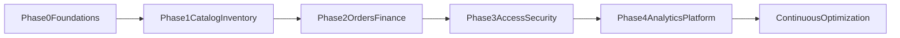

# Admin Web Master Roadmap

## 1) Purpose and Scope

This document defines the execution roadmap to evolve the admin web app from the current Stitch-aligned MVP screens into a full product-grade operations console.

Scope includes:

- UI and UX parity hardening against the 7 Stitch reference screens.
- Functional expansion across catalog, inventory/procurement, orders/finance, staff/security, analytics/reporting, and platform operations.
- API, data model, QA, rollout, and operational readiness requirements.

Out of scope for this document:

- Editing the plan artifact file.
- Immediate implementation details for every user story (those are phase execution docs).

Primary references:

- `docs/stitch/admin-web/README.md`
- `docs/stitch/admin-web/ui-spec-matrix.md`
- `docs/stitch/admin-web/manifest.json`
- `services/api/app/routers/admin_web.py`
- `apps/admin-web/src/app/(main)/overview/page.tsx`
- `apps/admin-web/src/app/(main)/orders/page.tsx`
- `apps/admin-web/src/app/(main)/suppliers/page.tsx`
- `apps/admin-web/src/app/(main)/analytics/page.tsx`
- `apps/admin-web/src/app/(main)/entries/page.tsx`
- `apps/admin-web/src/app/(main)/inventory/page.tsx`
- `apps/admin-web/src/app/(main)/staff/page.tsx`

## 2) Current Capability Matrix (As-Is)

### 2.1 Route-level capability matrix

| Route | Current UI capability | Current API dependency | Coverage level |
|---|---|---|---|
| `/overview` | KPI tiles + recent activity list + error state | `GET /v1/admin/dashboard-summary` | Medium |
| `/orders` | List/search/status filter + keyset pagination + basic rows | `GET /v1/admin/transactions` | Medium |
| `/suppliers` | Create supplier + list + status/search filters + basic badges | `GET/POST /v1/admin/suppliers` | Medium |
| `/analytics` | 30-day gross sales bar chart + daily table | `GET /v1/admin/analytics/sales-series` | Low-Medium |
| `/entries` | Quick create shop/product/group + optional variant label | `POST /v1/admin/shops`, `POST/GET /v1/admin/product-groups`, `POST /v1/admin/products` | Medium |
| `/inventory` | Stock snapshot by shop + movement journal + type filter + pagination | `GET /v1/admin/inventory/movements`, `GET /v1/admin/shops`, `GET /v1/inventory/shop/{shop_id}/products` | Medium |
| `/staff` | List operators + role filter/search + role patch + active toggle | `GET/PATCH /v1/admin/operators` | Medium |

### 2.2 Backend admin API footprint currently exposed

From `services/api/app/routers/admin_web.py`:

- Transactions: list with filters and cursor.
- Dashboard summary.
- Analytics sales series.
- Suppliers: list/create/patch.
- Inventory movements: list with filters and cursor.
- Operators: list/patch.
- Shops: list/create.
- Products: create/patch.
- Product groups: list/create.

### 2.3 Cross-cutting baseline

- Tenant scope is JWT-bound and enforced server-side.
- Shared primitives exist (`PageHeader`, `Panel`, `Badge`, form buttons/inputs, `EmptyState`, `ErrorState`, `LoadingRow`).
- Basic loading/empty/error patterns are implemented in most routes.

## 3) Stitch UI Parity Delta (Current vs Reference)

Stitch reference HTMLs:

- `docs/stitch/admin-web/executive-overview/screen.html`
- `docs/stitch/admin-web/order-audit-ledger/screen.html`
- `docs/stitch/admin-web/supplier-hub/screen.html`
- `docs/stitch/admin-web/analytics-insights/screen.html`
- `docs/stitch/admin-web/new-entry-hub/screen.html`
- `docs/stitch/admin-web/inventory-ledger/screen.html`
- `docs/stitch/admin-web/staff-permissions/screen.html`

### 3.1 Global UI system deltas

1. **Surface language**
   - Stitch uses layered vellum surfaces (`surface-container-low`, `surface-container-lowest`) and subtle tonal depth.
   - Current app still relies on standard card borders/shadows and less nuanced elevation.

2. **App chrome richness**
   - Stitch includes richer top utility bar patterns (global search, notifications, settings, contextual actions).
   - Current shell has simpler top strip and fewer global actions.

3. **Interaction density**
   - Stitch shows richer context cards, segmented controls, export/date actions, and secondary analytics modules.
   - Current routes prioritize essential data and simpler interaction model.

4. **Visual hierarchy**
   - Stitch uses stronger editorial typography hierarchy and compositional asymmetry.
   - Current pages are cleaner but flatter, with less expressive hierarchy.

5. **Stateful data widgets**
   - Stitch screens include richer semantic badges/status clusters and health cards.
   - Current screens mostly show list/table-centric status output.

### 3.2 Route-level parity summary

| Route | Parity status | Key gaps |
|---|---|---|
| Overview | Near-match | Missing advanced trend modules and richer top-level controls |
| Orders | Partial-match | Missing shift health cards, exception workflows, and export/report controls |
| Suppliers | Partial-match | Missing partner scorecards, lead-time/reliability visuals, and richer supplier actions |
| Analytics | Partial-match | Missing multi-panel analytics depth, category/retention widgets, and time-grain controls |
| Entries | Partial-match | Missing multi-step editorial workflow and preview/publish draft system |
| Inventory | Partial-match | Missing valuation/reorder summary bento and denser operational controls |
| Staff | Partial-match | Missing governance matrix UX and policy-centric permission editor |

## 4) Target Product Capability Model (To-Be)

## Domain A: Catalog and Pricing

- Product lifecycle management (draft, active, archived, discontinued).
- Variant model with structured attributes and matrix editor.
- Price books by channel/shop/time period.
- Tax rules and overrides by jurisdiction/channel.
- Promotions engine (coupons, bundles, thresholds, schedules, caps).

Dependencies:

- Product, variant, pricing, taxation schema extensions.
- Audit history for all price/tax changes.

## Domain B: Inventory and Procurement

- Purchase order lifecycle (draft, approval, sent, partial receipt, closed).
- Receiving workflow with discrepancy handling.
- Supplier performance and SLA metrics.
- Transfer orders and inter-shop balancing.
- Cycle count and stocktake operations.
- Reorder policy automation (min/max, demand trend recommendations).

Dependencies:

- PO, receipt, transfer, stocktake tables and status transitions.
- Ledger + valuation model harmonization.

## Domain C: Orders and Finance Operations

- Order detail timeline with event journal.
- Refund workflow with policy and approval gates.
- Payment reconciliation (gateway, cash, ledger).
- Shift closeout and discrepancy investigations.
- Chargeback/dispute management.

Dependencies:

- Transaction event sourcing depth.
- Finance export contracts (accounting format, tax breakdown).

## Domain D: Staff, Security, Compliance

- RBAC role and permission model.
- Policy templates (admin/operator/view-only/finance roles).
- Admin audit explorer (who/what/when/where).
- Session/device controls and forced sign-out.
- Security policy controls (2FA requirements, lockout, access review cadence).

Dependencies:

- Permission graph and policy evaluation middleware.
- Immutable admin action logs.

## Domain E: Analytics and Reporting

- Multi-dimensional dashboards (sales, margin, conversion, retention, supplier).
- Drill-through from KPI to transaction-level detail.
- Scheduled reports and export jobs.
- Saved views, filters, and comparison periods.
- Anomaly detection and threshold alerts.

Dependencies:

- Aggregation pipelines/materialized views.
- Report execution and delivery service.

## Domain F: Platform Operations

- Tenant settings center (currency, timezone, business profile, docs).
- Integration center (webhooks, accounting, tax, ERP connectors).
- Notification orchestration.
- Feature flag control for staged rollouts.
- Health and diagnostics surfaces.

Dependencies:

- Integration credential vaulting.
- Event bus + delivery status observability.

## 5) Roadmap by Phases

### Phase 0: Foundations and UI parity control

Goals:

- Lock shared UI token usage and component behavior.
- Establish route-by-route parity checks versus Stitch references.
- Standardize state handling and table/filter patterns.

Deliverables:

- UI parity checklist per route.
- Component usage contract for admin screens.
- Visual regression baseline snapshots for 7 routes.
- Updated runbook checklist for parity QA.

Exit criteria:

- All 7 routes pass baseline consistency and state handling checks.
- No route diverges from approved shared primitives without documented exception.

### Phase 1: Catalog + inventory/procurement core

Goals:

- Shift from quick-create to full management workflows.

Deliverables:

- Product list/detail/edit module with bulk operations.
- Variant and group management workspace.
- Supplier enhancement (edit lifecycle + notes + status flows).
- PO + receiving v1.
- Stock adjustments with reason/approval controls.

Exit criteria:

- End-to-end create/manage/reconcile for products and inbound stock.
- Role-limited mutation actions are enforced.

### Phase 2: Orders + finance control tower

Goals:

- Provide finance-grade operational confidence and reconciliation.

Deliverables:

- Order detail timeline and exception handling.
- Refund approvals and audit.
- Reconciliation dashboard (cash/card/ledger differences).
- Export/report package for accounting.

Exit criteria:

- Daily closeout can be executed from admin app.
- Reconciliation discrepancies are traceable to source events.

### Phase 3: Access + trust layer

Goals:

- Harden governance and security for production scale.

Deliverables:

- RBAC model and policy editor.
- Action audit explorer with export.
- Session/device controls.
- Security policy administration.

Exit criteria:

- Permission coverage defined for all sensitive operations.
- Security and compliance reporting available for audits.

### Phase 4: Advanced analytics + platform integrations

Goals:

- Move from operational dashboards to strategic intelligence and ecosystem integrations.

Deliverables:

- Deep analytics modules (margin/cohort/supplier performance).
- Scheduled reports and alerts.
- Integration/webhook management center.
- Operational telemetry and health panel.

Exit criteria:

- Leadership reporting and external system integration support are production-ready.

## 6) Workstreams and Ownership Model

Recommended workstreams:

1. **Frontend experience**
   - Route UX, design system compliance, interaction patterns.

2. **API and domain model**
   - Admin contracts, schema evolution, authorization policy support.

3. **Data and reporting**
   - Aggregations, exports, analytics consistency.

4. **Security and governance**
   - RBAC, audit logging, session controls, compliance.

5. **Quality and release**
   - Automated tests, visual regression, runbook updates, staged rollout.

## 7) Risks and Mitigations

| Risk | Impact | Mitigation |
|---|---|---|
| UI drift from Stitch language during rapid delivery | Inconsistent user trust and perceived quality | Enforce component contracts and visual regression gates |
| API expansion without clear domain boundaries | Rework and unstable contracts | Domain-owned API specs and schema ADRs per phase |
| Incomplete RBAC model during feature growth | Security gaps and production risk | Introduce permission matrix before high-risk modules ship |
| Reporting mismatches across modules | Financial credibility issues | Centralize metric definitions and reconciliation tests |
| Overloading single release trains | Delivery delays | Parallel workstreams with phase gates and kill-switches |

## 8) Definition of Done (Per Epic and Per Phase)

Every epic must meet:

- Product acceptance criteria mapped to UI states (happy/empty/loading/error/failure recovery).
- API contract coverage with integration tests.
- Tenant scope and permission checks validated.
- Auditability for sensitive writes.
- Runbook update for operations/support.
- Telemetry for success/error events.

Every phase must meet:

- Milestone demo using seeded realistic data.
- QA signoff on regression + parity checks for touched routes.
- Security review for new privileged actions.
- Release notes and rollback strategy documented.

## 9) KPI Framework

### Delivery KPIs

- Lead time from spec to production by module.
- Defect escape rate by phase.
- UI parity audit score across the 7 baseline routes.

### Product KPIs

- Task completion rate for core admin flows.
- Time-to-resolution for inventory/order exceptions.
- Reconciliation success rate without manual corrections.
- Staff permission incident count (target: near-zero).

### Reliability KPIs

- API error rate for admin endpoints.
- Report generation success/latency.
- Data freshness lag for analytics widgets.

## 10) Immediate Next Actions (Execution order)

1. Finalize Phase 0 parity gate checklist and add to runbook workflows.
2. Create capability-to-API contract map by domain and phase.
3. Prioritize Phase 1 backlog into implementation epics:
   - Product management
   - Variant and pricing management
   - Procurement v1
   - Stock governance
4. Define RBAC baseline before expanding financial and supplier mutation flows.
5. Establish visual and integration CI checks before major feature rollout.

## 11) Appendix: Stitch-to-Route Mapping

| App route | Stitch screen id | Reference HTML |
|---|---|---|
| `/overview` | `c41290bb6b3c49daaf584818fbec282f` | `docs/stitch/admin-web/executive-overview/screen.html` |
| `/orders` | `bd729c55e4944488bb465b9cc44e19ee` | `docs/stitch/admin-web/order-audit-ledger/screen.html` |
| `/suppliers` | `46aa7e73c37a46998ef3899377ae7aaf` | `docs/stitch/admin-web/supplier-hub/screen.html` |
| `/analytics` | `e0ae24d061944017a964a1a4fbc82817` | `docs/stitch/admin-web/analytics-insights/screen.html` |
| `/entries` | `376fb70716e64c8c9de7af90b98df7cc` | `docs/stitch/admin-web/new-entry-hub/screen.html` |
| `/inventory` | `f98f213ca4bf42ba888b56a17d6ea2cf` | `docs/stitch/admin-web/inventory-ledger/screen.html` |
| `/staff` | `4a460c16c35841d59faef891a5a12127` | `docs/stitch/admin-web/staff-permissions/screen.html` |
