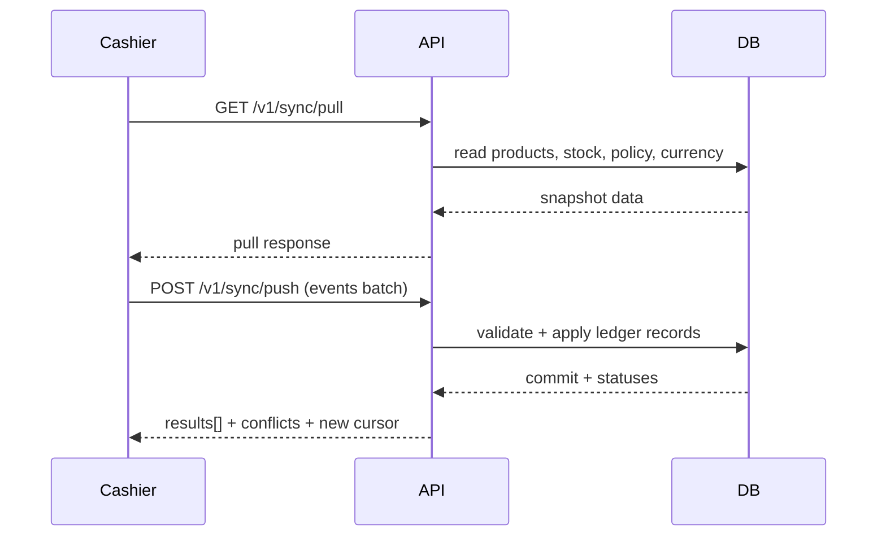

# Sync Architecture

This document focuses on the offline-first sync pipeline between cashier devices and the central API.

## Contract source of truth

- `packages/sync-protocol/openapi.yaml`

## Main endpoints

- `GET /v1/sync/pull`
- `POST /v1/sync/push`
- `GET /v1/transactions` (device-visible history)

## Pull flow

Device requests pull with current auth and shop context.

Server returns:

- Product catalog rows
- Stock snapshots
- Tenant offline policy
- Tenant currency metadata

Cashier updates local read models and refreshes sync status metadata.

## Push flow

Device sends batch with:

- `device_id`
- `idempotency_key`
- ordered `events`

Current event types:

- `sale_completed`
- `ledger_adjustment`

Server-side behavior:

- validate tenant/shop/device scope
- enforce payment/stock invariants
- apply immutable movement/transaction records
- return per-event status (`accepted`, `duplicate`, `rejected`)
- attach structured `conflict` object for rejected events

## Conflict semantics

Client should rely on `conflict.code` and typed fields rather than free-text parsing.

Examples:

- `insufficient_stock`
- `payment_total_mismatch`
- `shop_not_allowed_for_device`
- `unknown_product`
- `card_requires_connectivity`

## Idempotency model

- Commercial transactions: unique by `(tenant_id, client_mutation_id)`
- Stock movement adjustments: unique movement idempotency key per scoped tuple
- Duplicate submissions should resolve to `duplicate`, not replay side effects

## Offline behavior

- Cash sales may queue offline
- Card sales require active connectivity by default
- Outbox is flushed on connectivity restoration and explicit sync attempts
- Rejected outbox entries surface user-facing reconciliation messages

## Sequence diagram

